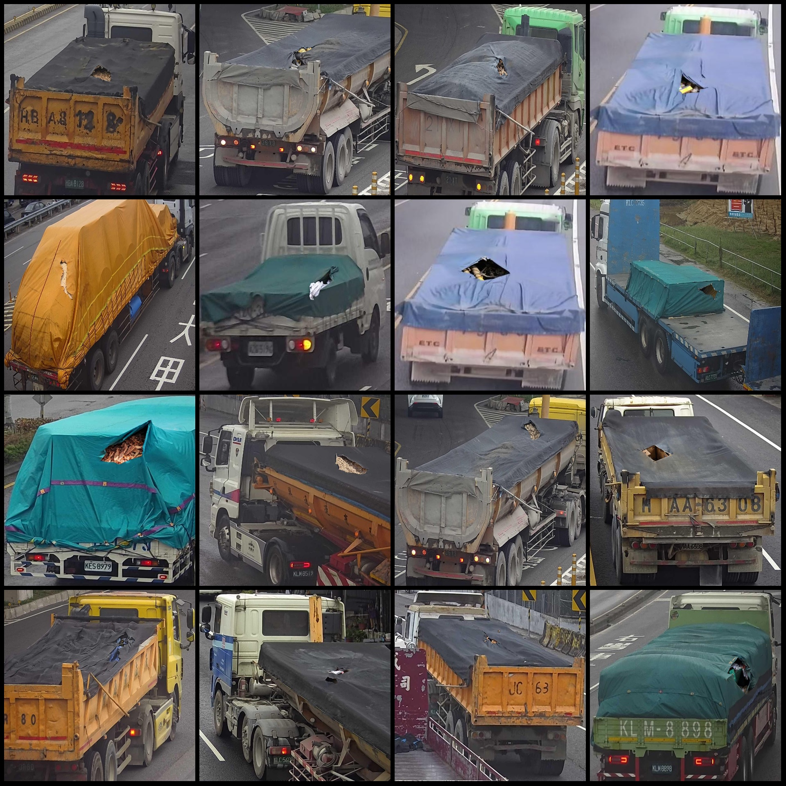
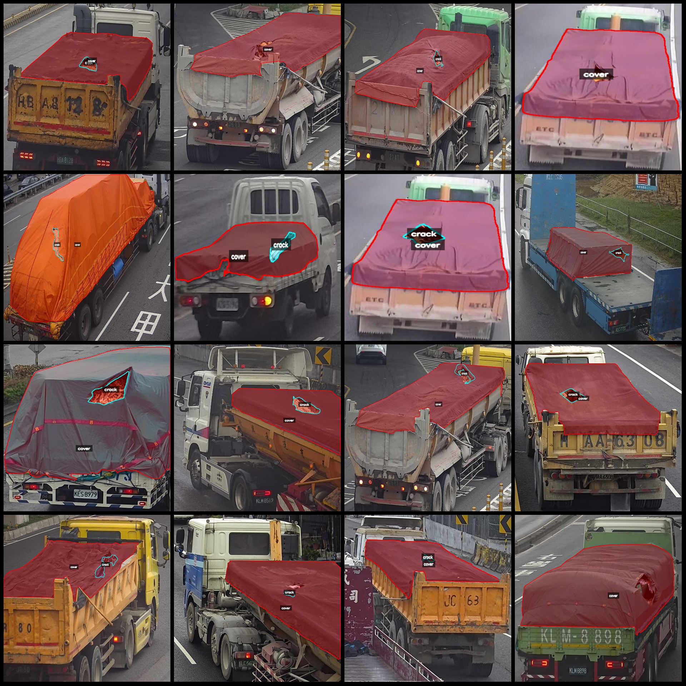
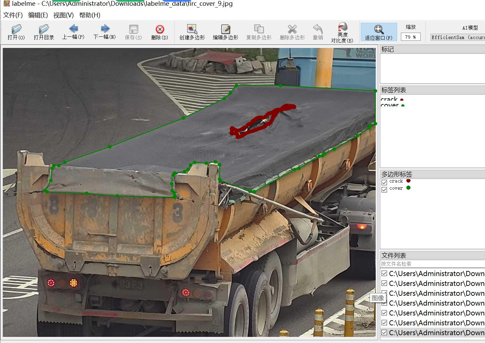

# Intelligent Transportation Truck and Van Waterproof Poncho and Rain Cover Damage Identification and Separation Dataset (LabelMe format) - 1894 Categories

Dataset Format: LabelMe format (without mask files, only containing jpg images and corresponding json files)
Number of Images (JPG file count): 1894
Number of Annotations (JSON file count): 1894
Number of Annotation Categories: 2
Annotation Category Names: ["crack", "cover"]
Number of Polygons for Each Category:
crack (Poncho/Rain Cover Damage) count = 1830
cover (Poncho) count = 1898
Total Polygon Count: 3728
Using Annotation Tool: LabelMe version 5.5.0
Image Resolution: Multi-resolution images, such as 641x527, 719x683, etc.
Annotation Rules: Draw polygons around categories.
Important Notice: The dataset can be opened for editing in LabelMe, but the JSON dataset needs to be converted into either a mask or Yolo or COCO format for semantic segmentation or instance segmentation.
Special Remark: This dataset does not guarantee the accuracy of the trained models or weight files.
Image Preview:
Annotation Example:
Original Image (randomly selected 16 images):
Annotation Drawing Results:
LabelMe Editing Image Example:

## Image

Here is a pay link on Stripe ( https://buy.stripe.com/3cs8yP7sY87d0vu9AB ). Please contact me lonlonago@foxmail.com after funding $89, and I will send you a complete data files , thank you!

